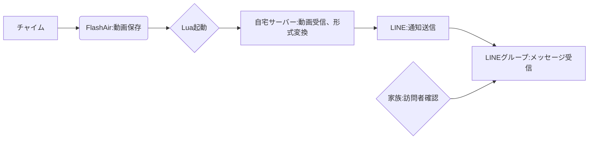

# 家のチャイムをスマホで確認できたら便利ではないでしょうか？
「家に帰れば誰が来たか分かるから必要ない」と思う方もいるでしょう。しかし、次のような状況では非常に役立ちます：

- 長期出張や旅行で家を空けているときに誰が来たか確認したい
- 複数の家（事務所含む）を持っていたり管理している場合
- 在宅勤務中に仕事に集中しながらも来客を把握したい
- 高齢の親の家の訪問者を遠隔で確認したい

このような方には、今回紹介するシステムが役立つかもしれません。

# 作成したシステムの概要

今回作成したシステムは、家のチャイムが押されるとドアホンのカメラで録画された映像をLINEに自動通知してくれます。これにより、スマホやスマートウォッチで外出先からでもすぐに来客を確認できます。
システム全体の流れは以下の図のとおりです



このシステムは大きく3つのパートで構成されています：

1. チャイム側: FlashAirを使ってドアホンの録画データを取得
2. サーバー側: データを受信して適切な動画形式に変換
3. LINE連携: 変換した動画をLINEグループに通知として送信

それでは、各パートの実装方法を順に説明していきます。

## チャイムにFlashAirを接続できるようにする
PanasonicのチャイムにはMicroSDカードを差し込む場所があり、録画データをSDカードに記録できるようになっています。
ここにFlashAirを接続することで、録画データの生成をフックにFlashAir内でLuaスクリプトを動かして色々できるようになります。

FlashAirはSDカードサイズなのでMicro SDよりも大きく、そのままではPanasonicのチャイムに差し込む事ができないため、以下のような変換基盤を利用します。

[NFHK TF Micro SD オスエクステンダー - SDカードメス延長アダプター PCBA SD/SDHC/SDXC UHS-III UHS-3 UHS-2](https://amzn.to/41vOoto)

もっと安い変換基盤がたくさん売っていますし私もいくつか持っていたのですが安定して使えるのはこれだけでした。おすすめです。


## FlashAirを入手する

FlashAirとは、Wi-Fi機能を搭載したSDカードで、データの無線転送だけでなくプログラミング言語Luaでカスタム機能を実装できる優れたデバイスです。残念ながら現在は販売終了していますが、メルカリなどのフリマアプリで入手可能です。
FlashAirには複数のバージョンがありますが、今回の目的にはW-03またはW-04が必要です。これは[FlashAir Developers](https://flashair-developers.github.io/website/)の[FlashAirでできること](https://flashair-developers.github.io/website/docs/discover/usage.html)によると、Luaをサポートしているのはこの2機種のみだからです。私は価格と性能のバランスからW-03を選びましたが、可能であればより高性能なW-04を選ぶことをお勧めします。

:::message
AIが進化してソフトウェアが簡単に書けるようになった今の時代こそFlashAirほしいですよね。再販してほしいなー。
ちなみに導入して1年ちょっとくらいたちますがFlashAirは安定動作していて偉いなぁと思います。
:::

## (番外編) フタをつくる

変換基盤で接続すると、下側に大きくはみだしてしまうので、元のケースが使えなくなってしまいます。
むき出しで利用しても問題ないのですが、家族に触られると不具合の原因になるので3Dプリンタでケースを作っておきました。


セットするとこんな感じになります。


## Luaプログラムを作成する

FlashAirの動作をカスタマイズするために、Luaプログラムを作成します。このプログラムの主な役割は、チャイムが押されて録画データが生成されたときに、そのデータを自宅サーバーに送信することです。
以下のプログラムを、FlashAirの隠しフォルダ「SD_WLAN」内の「CONFIG」ファイルに指定することで、自動的に実行されるようになります。具体的には、CONFIG内に「LUA_RUN_SCRIPT=/スクリプトのパス.lua」という行を追加します。
このプログラムは以下の処理を行います：

1. Wi-Fi接続を確立
2. 最新の録画ファイルを検索
3. 見つかったファイルを自宅サーバーのreceive_dat.phpに送信

```lua
result = fa.WlanLink()
if result == 0 then
	sleep(15000)
end

local cjson = require "cjson"
local IMG_DIR = "/ROOT/IP_V14U/DATA/GUEST"

local function uploadFile(path, file)
	local filesize = lfs.attributes(path, "size")
	if filesize ~= nil then
		print("Uploading " .. path .. " size: " .. filesize)
	else
		print("Failed to find " .. path .. "... something wen't wrong!")
		return
	end

	local URL = "http://サーバーのURL/receive_dat.php"
	local MESSAGE = "upload file"

	local boundary = "------------------------908511f2c01b0981"
	local contenttype = "multipart/form-data; boundary=" .. boundary
	local mes = "--" .. boundary .. "\r\n"
	.. "Content-Disposition: form-data; name=\"message\"\r\n"
	.. "Content-Type: text/plain\r\n"
	.. "\r\n"
	.. MESSAGE .. "\r\n"
	.. "--" .. boundary .. "\r\n"
	.. "Content-Disposition: form-data; name=\"movieFile\" filename=\"" .. file .. "\"\r\n"
	.. "Content-Type: image/jpeg\r\n"
	.. "\r\n"
	.. "\r\n"
	.. "--" .. boundary .. "--"

	fa.request {
		url = URL,
		method = "POST",
		headers = {
			["Content-Type"] = contenttype,
			["Content-Length"] = tostring(filesize + string.len(mes) - 17)
		},
		file = path,
		bufsize = 1460*10,
		body = mes
	}
end

local function targetFile(tgtDir)
	local tgtPath = ""
	local tgtFile = ""
	local tgtFileMod = 0

	for filename in lfs.dir(tgtDir) do
		if(string.sub(filename, 1, 1) ~= ".") then
			local filepath = tgtDir .. "/" .. filename
			local mod = lfs.attributes(filepath, "modification")
			if mod > tgtFileMod then
				tgtFileMod = mod
				tgtPath = filepath
				tgtFile = filename
			end
		end
	end

	if tgtPath ~= "" then
		uploadFile(tgtPath, tgtFile)
	end
end

targetFile(IMG_DIR)

collectgarbage()
```

:::message
重要なポイント: 上記コード内の「http://サーバーのURL/receive_dat.php」の部分は、あなたの自宅サーバーのURLに置き換える必要があります。
:::

# 自宅サーバー側の処理

自宅サーバー側では、FlashAirから送信されたデータを受け取り、適切な形式に変換してLINEに通知する処理を行います。この部分は私の場合、PHP言語を使って実装しました。他の言語（GoやPythonなど）でも同様の処理が可能です。

## 必要な環境とツール

1. Webサーバー（Apache、Nginxなど）
2. PHP（バージョン7.4以上推奨）
3. dat2avi（チャイムの録画データをMP4に変換するツール）
4. ffmpeg（動画処理ツール、サムネイル作成に使用）
5. LINE Messaging API（LINE公式アカウントと連携）

## LINE API の準備

LINE通知機能を使うには、LINE Messaging APIの設定が必要です。詳細は [LINE Notify APIが終了するのでLINE Messaging APIに移行する](https://zenn.dev/halt/articles/20241023_line_messaging) の記事が参考になります。

基本的な手順は次のようになります。

1. LINE Developers Consoleでチャンネルを作成
2. チャンネルアクセストークンを取得
3. LINE公式アカウントを作成し、友達登録またはグループに追加

## 外部からのアクセス設定
LINEで動画を表示するには、サーバーの動画URLに外部からアクセスできる必要があります。以下のいずれかの方法で設定します：

- Cloudflare Tunnelやngrokなどのトンネリングツールを使用
- 固定IPがある場合は、ルーターでポート転送を設定
- クラウドサーバーを利用する場合は、適切なネットワーク設定

## サーバー側のPHPコード

以下のPHPコードで、FlashAirからのデータ受信、動画変換、LINE通知を実装しています

```php
<?php

define('LINE_CHANNEL_ACCESS_TOKEN', 'あらかじめ用意したトークンを入れる');

date_default_timezone_set('Asia/Tokyo');

function is_dup(string $filepath) {

    $files = glob(dirname($filepath) . '/*.DAT'); // DATフォルダ内の.DATファイルを配列に格納

    if (count($files) < 2) {
        return false;
    }

    if (empty($files)) {
        return false;
    }

    // ファイルの更新日時で降順にソート
    usort($files, function($a, $b) {
        return filemtime($b) - filemtime($a);
    });

    // 最新の2つのファイルを取得
    $latestFiles = array_slice($files, 0, 3);

    if (count($latestFiles) === 1) {
        return false;
    } else {
        if (filesize($latestFiles[0]) === filesize($latestFiles[1])) {
            return true;
        } else {
            return false;
        }
    }
}

function notify_line(string $id, string $token, string $message, string $video_url) {

    $format_text = [
        "type" => "text",
        "text" => $message
    ];

    $format_video = [
        "type" => "video",
        "originalContentUrl" => $video_url,
        "previewImageUrl" => str_replace('.mp4', '.png', $video_url),
    ];

    $post_data = [
        "to" => $id,
        "messages" => [$format_text, $format_video]
    ];

    $header = [
        'Content-Type: application/json',
        'Authorization: ' . 'Bearer ' . $token
    ];

    $options = [
        'http' => [
            'header'  => implode("\r\n", $header),
            'method'  => 'POST',
            'content' => json_encode($post_data),
            'ignore_errors' => true // エラーレスポンスも受け取る
        ]
    ];

    $context  = stream_context_create($options);
    $result = file_get_contents('https://api.line.me/v2/bot/message/push', false, $context);

    return $result;
}

function convert_data($data) {

    $output = "";
    $retval = "";

    // すでにあるなら捨てる
    $video = str_replace('.DAT', '.mp4', $data);
    if (file_exists($video)) {
        unlink($video);
    }

    exec('/bin/dat2avi ' . $data, $output, $retval);

    // すでにあるなら捨てる
    $png = str_replace('.DAT', '.png', $data);
    if (file_exists($png)) {
        unlink($png);
    }
    exec('/bin/ffmpeg -i ' . $video . ' -vframes 1 ' . $png, $output, $retval);

}

function add_log(string $log) {
    $filename = "log.txt";
    file_put_contents($filename, date("[Y-m-d H:i:s] ") . $log . PHP_EOL, FILE_APPEND);
}

$filepath = '保存先のディレクトリ/' . date('YmdHis') . ".DAT";
$request_body = file_get_contents('php://input');
file_put_contents($filepath, $request_body);
add_log("called");

if (file_exists($filepath)) {

    if (is_dup($filepath)) {
        unlink($filepath);
        add_log("unlink");
        exit;
    }

    convert_data($filepath);

    $video_url = "https://Cloudflare TunnelやngrokなどのURL/" . str_replace('.DAT', '.mp4', $filepath);
    $group_id = 'あらかじめ用意したIDをいれる';
    $message = "チャイムが押されました";
    notify_line($group_id, LINE_CHANNEL_ACCESS_TOKEN, $message, $video_url);
}

echo 'done';

```

### コードの主な機能：

1. FlashAirから送信されたデータをファイルとして保存
2. 重複データのチェックと除外
3. dat2aviとffmpegを使った動画形式変換とサムネイル作成
4. LINE Messaging APIを使った通知送信

### 設定が必要な項目：

- LINE_CHANNEL_ACCESS_TOKEN: LINE Developers Consoleで取得したトークン
- 保存先ディレクトリパス
- 動画URLの公開アドレス
- LINE通知先のグループID

# まとめ

今回は、FlashAir、自宅サーバー、LINE APIという3つの技術を組み合わせて、チャイムの通知システムを構築しました。様々な技術を連携させる必要がありますが、完成すれば外出先からでも来客を即座に確認できる便利なシステムとなります。

## 応用可能性
このシステムは以下のようなケースにも応用できます：

- 宅配便の配達通知
- 自宅セキュリティの一部として
- 高齢者の見守りシステムとして

## カスタマイズのポイント
チャイムのメーカーや自宅のネットワーク環境によって設定は異なりますが、基本的な構成は同じです。自分の環境に合わせて以下の部分を調整してください：

1. チャイムとFlashAirの接続方法
2. サーバー環境（クラウドサーバーでも可）
3. 通知方法（LINEの他にSlackやメールなども可能）

少し手間はかかりますが、自分だけのスマートホームシステムを構築する第一歩として、ぜひ挑戦してみてください。何か質問があれば、コメント欄でお気軽にお尋ねください。
