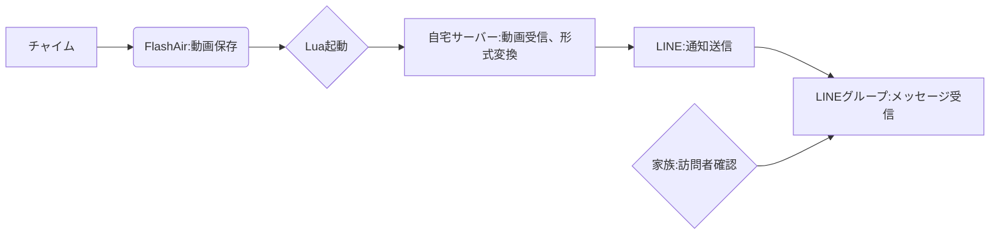

# 家のチャイムがなったことをいつでもどこでも即時確認したいですよね？

「は？そうか？家帰って確認すりゃええやろ」と思った方には必要のない情報です。

・長期出張や旅行で家を空けているときに誰が来てるか心配
・複数の家（事務所含む）を持っていたり管理している

などの人にはニーズがあるかもしれません。

# なにを作ったか

家のチャイムが押されるとドアホンのカメラで録画された情報をLINEに通知してくれます。
LINEに通知が来ればスマホやスマートウォッチですぐに来客を把握できるというわけです。

Geminiがシステム全体の流れを図にしてくれました。（ちょっとわかりづらいですね）



# FlashAirから自宅サーバーに画像送信する

まずはチャイムデバイス周辺の紹介をします。

## チャイムにFlashAirを接続できるようにする
PanasonicのチャイムにはMicroSDカードを差し込む場所があり、録画データをSDカードに記録できるようになっています。
ここにFlashAirを接続することで、録画データの生成をフックにFlashAir内でLuaスクリプトを動かして色々できるようになります。

FlashAirはSDカードサイズなのでMicro SDよりも大きく、そのままではPanasonicのチャイムに差し込む事ができないため、以下のような変換基盤を利用します。

[NFHK TF Micro SD オスエクステンダー - SDカードメス延長アダプター PCBA SD/SDHC/SDXC UHS-III UHS-3 UHS-2](https://amzn.to/41vOoto)

もっと安い変換基盤がたくさん売っていますし私もいくつか持っていたのですが安定して使えるのはこれだけでした。おすすめです。


## FlashAirを入手する

FlashAir自体はもう販売終了してしまっているので、メルカリで購入しました。 FlashAirにはいくつかバージョンがあるようなのですが、値段と性能のバランスを考慮してW-03を購入しました。
FlashAirはW-04が最新でW-03よりもハイスペックになっているようなので皆さんが試すならW-04を使ったほうがいいかもしれません。
FlashAirに関する情報をまとめてくださっている[FlashAir Developers](https://flashair-developers.github.io/website/)というサイトの[FlashAirでできること](https://flashair-developers.github.io/website/docs/discover/usage.html)によると、LuaをサポートしているのはW-03とW-04だけなので、この2機種以外だと今回の用途には使えなさそうです。

:::message
AIが進化してソフトウェアが簡単に書けるようになった今の時代こそFlashAirほしいですよね。再販してほしいなー。
ちなみに導入して1年ちょっとくらいたちますがFlashAirは安定動作していて偉いなぁと思います。
:::

## (番外編) フタをつくる

変換基盤で接続すると、下側に大きくはみだしてしまうので、元のケースが使えなくなってしまいます。
むき出しで利用しても問題ないのですが、家族に触られると不具合の原因になるので3Dプリンタでケースを作っておきました。


セットするとこんな感じになります。


## Luaプログラムを書く

作ったのが1年以上前なのでどうしてこうなってるのかすっかり忘れてしまったので、今動いているものをそのまま貼ります。
隠しフォルダの SD_WLAN フォルダに CONFIG があるので、そこにファイル名を指定するといい感じに起動するようになります。

これで、チャイムがなったらデータが自宅サーバーのreceive_dat.phpに送信されます。

```lua
result = fa.WlanLink()
if result == 0 then
	sleep(15000)
end

local cjson = require "cjson"
local IMG_DIR = "/ROOT/IP_V14U/DATA/GUEST"

local function uploadFile(path, file)
	local filesize = lfs.attributes(path, "size")
	if filesize ~= nil then
		print("Uploading " .. path .. " size: " .. filesize)
	else
		print("Failed to find " .. path .. "... something wen't wrong!")
		return
	end

	local URL = "http://サーバーのURL/receive_dat.php"
	local MESSAGE = "upload file"

	local boundary = "------------------------908511f2c01b0981"
	local contenttype = "multipart/form-data; boundary=" .. boundary
	local mes = "--" .. boundary .. "\r\n"
	.. "Content-Disposition: form-data; name=\"message\"\r\n"
	.. "Content-Type: text/plain\r\n"
	.. "\r\n"
	.. MESSAGE .. "\r\n"
	.. "--" .. boundary .. "\r\n"
	.. "Content-Disposition: form-data; name=\"movieFile\" filename=\"" .. file .. "\"\r\n"
	.. "Content-Type: image/jpeg\r\n"
	.. "\r\n"
	.. "\r\n"
	.. "--" .. boundary .. "--"

	fa.request {
		url = URL,
		method = "POST",
		headers = {
			["Content-Type"] = contenttype,
			["Content-Length"] = tostring(filesize + string.len(mes) - 17)
		},
		file = path,
		bufsize = 1460*10,
		body = mes
	}
end

local function targetFile(tgtDir)
	local tgtPath = ""
	local tgtFile = ""
	local tgtFileMod = 0

	for filename in lfs.dir(tgtDir) do
		if(string.sub(filename, 1, 1) ~= ".") then
			local filepath = tgtDir .. "/" .. filename
			local mod = lfs.attributes(filepath, "modification")
			if mod > tgtFileMod then
				tgtFileMod = mod
				tgtPath = filepath
				tgtFile = filename
			end
		end
	end

	if tgtPath ~= "" then
		uploadFile(tgtPath, tgtFile)
	end
end

targetFile(IMG_DIR)

collectgarbage()
```

# 自宅サーバーでファイルを受取り通知する
私はPHP歴が長いのでPHPで対応しました。WebサーバーとPHPを入れて、以下のphpで受け取っています。
dat2aviはチャイムの録画データをmp4に変換しています。
PHPだとインストールのハードルが高いのでGoとかで書くとよいかもしれないです。

LINE周りの情報は[LINE Notify APIが終了するのでLINE Messaging APIに移行する](https://zenn.dev/halt/articles/20241023_line_messaging)が参考になるかと思います。

LINEで動画を表示するにはサムネイルのURLと動画のURLが外からアクセスできる必要があるため、Cloudflare Tunnelやngrokなどのツールを使ったり、固定IPがある場合はルーターの設定を変更するなどして対応してください。

```php
<?php

define('LINE_CHANNEL_ACCESS_TOKEN', 'あらかじめ用意したトークンを入れる');

date_default_timezone_set('Asia/Tokyo');

function is_dup(string $filepath) {

    $files = glob(dirname($filepath) . '/*.DAT'); // DATフォルダ内の.DATファイルを配列に格納

    if (count($files) < 2) {
        return false;
    }

    if (empty($files)) {
        return false;
    }

    // ファイルの更新日時で降順にソート
    usort($files, function($a, $b) {
        return filemtime($b) - filemtime($a);
    });

    // 最新の2つのファイルを取得
    $latestFiles = array_slice($files, 0, 3);

    if (count($latestFiles) === 1) {
        return false;
    } else {
        if (filesize($latestFiles[0]) === filesize($latestFiles[1])) {
            return true;
        } else {
            return false;
        }
    }
}

function notify_line(string $id, string $token, string $message, string $video_url) {

    $format_text = [
        "type" => "text",
        "text" => $message
    ];

    $format_video = [
        "type" => "video",
        "originalContentUrl" => $video_url,
        "previewImageUrl" => str_replace('.mp4', '.png', $video_url),
    ];

    $post_data = [
        "to" => $id,
        "messages" => [$format_text, $format_video]
    ];

    $header = [
        'Content-Type: application/json',
        'Authorization: ' . 'Bearer ' . $token
    ];

    $options = [
        'http' => [
            'header'  => implode("\r\n", $header),
            'method'  => 'POST',
            'content' => json_encode($post_data),
            'ignore_errors' => true // エラーレスポンスも受け取る
        ]
    ];

    $context  = stream_context_create($options);
    $result = file_get_contents('https://api.line.me/v2/bot/message/push', false, $context);

    return $result;
}

function convert_data($data) {

    $output = "";
    $retval = "";

    // すでにあるなら捨てる
    $video = str_replace('.DAT', '.mp4', $data);
    if (file_exists($video)) {
        unlink($video);
    }

    exec('/bin/dat2avi ' . $data, $output, $retval);

    // すでにあるなら捨てる
    $png = str_replace('.DAT', '.png', $data);
    if (file_exists($png)) {
        unlink($png);
    }
    exec('/bin/ffmpeg -i ' . $video . ' -vframes 1 ' . $png, $output, $retval);

}

function add_log(string $log) {
    $filename = "log.txt";
    file_put_contents($filename, date("[Y-m-d H:i:s] ") . $log . PHP_EOL, FILE_APPEND);
}

$filepath = '保存先のディレクトリ/' . date('YmdHis') . ".DAT";
$request_body = file_get_contents('php://input');
file_put_contents($filepath, $request_body);
add_log("called");

if (file_exists($filepath)) {

    if (is_dup($filepath)) {
        unlink($filepath);
        add_log("unlink");
        exit;
    }

    convert_data($filepath);

    $video_url = "https://Cloudflare TunnelやngrokなどのURL/" . str_replace('.DAT', '.mp4', $filepath);
    $group_id = 'あらかじめ用意したIDをいれる';
    $message = "チャイムが押されました";
    notify_line($group_id, LINE_CHANNEL_ACCESS_TOKEN, $message, $video_url);
}

echo 'done';

```

# まとめ

様々な技術を組み合わせてなんだかカオスな事になってしまいましたが、思った通りの機能を作れたので私は満足です。
チャイムのメーカーや自宅のネットワーク環境は人それぞれなので、この記事の内容をそのまま適用するわけにはいかないと思いますが、皆さんも挑戦してみてはいかがでしょうか？
