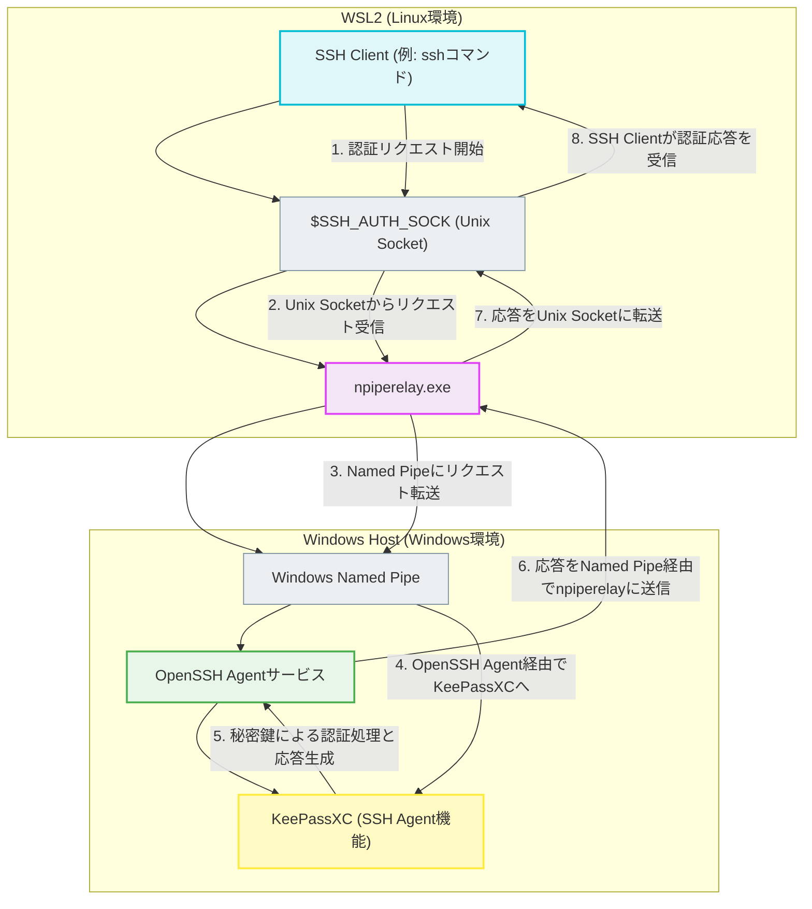

# KeePassXCのSSH AgentをWSL2で使う方法

KeePassXCにはSSH Agent機能があり、パスワードマネージャーに保存した秘密鍵をSSH認証に使える。これを利用すると、ファイルシステム上に秘密鍵をおかずにすむのでとても便利。
Windows上では快適に動作するが、WSL2から使おうとすると一工夫必要になる。

## 前提：なぜそのままでは動かないのか

WindowsのSSH AgentとWSL2は別の世界で動いている。WSL2はHyper-V上の軽量VMなので、Windowsのプロセスと直接通信できない。そのため、何らかの「橋渡し」が必要になる。

以下が全体の流れになる。



## 3つのアプローチ

Windows側のSSH Agentの恩恵をWSL2で受ける方法は大きく分けて3つある。

### 1. Interop機能でWindowsのssh.exeを使う

最もシンプルな方法。WSL2にはWindowsの実行ファイルを直接呼び出せるInterop機能があるので、これを利用する。

```bash
# ~/.bashrc や ~/.zshrc に追加
alias ssh="/mnt/c/Windows/System32/OpenSSH/ssh.exe"
alias ssh-add="/mnt/c/Windows/System32/OpenSSH/ssh-add.exe"
```

**メリット：** 設定が簡単。追加ツール不要。

**デメリット：** Windows側の `~/.ssh/config` が使われるため、WSL用に別の設定を持ちたい場合に困る。パスの扱いもWindows形式になるので、ホスト間でconfigを共有しにくい。

### 2. OpenSSHモード + npiperelay

KeePassXCの「OpenSSH for Windows」モードを使い、WindowsのOpenSSH AgentサービスにWSL2から接続する方法。

#### Windows側の準備

**OpenSSH Authentication Agentサービスを有効化（PowerShell管理者）：**

```powershell
Get-Service ssh-agent | Set-Service -StartupType Automatic
Start-Service ssh-agent
```

**KeePassXCの設定：**

WindowsでOpenSSHのssh-agentを動かしたあと、
ツール → 設定 → SSHエージェント で「Use OpenSSH for Windows instead of Pageant」を有効にする。

#### WSL側の準備

**必要なパッケージ：**

```bash
sudo apt install socat
```

**npiperelay.exeのダウンロード：**

```bash
# 重要：-L オプションでリダイレクトを追跡する
curl -L -o /mnt/c/Users/YOUR_USERNAME/npiperelay.exe \
  https://github.com/jstarks/npiperelay/releases/latest/download/npiperelay.exe
```

**シェル設定（~/.bashrc または ~/.zshrc）：**

```bash
export SSH_AUTH_SOCK=$HOME/.ssh/agent.sock
if ! ss -a | grep -q "$SSH_AUTH_SOCK"; then
  rm -f "$SSH_AUTH_SOCK"
  (setsid socat UNIX-LISTEN:$SSH_AUTH_SOCK,fork EXEC:"/mnt/c/Users/YOUR_USERNAME/npiperelay.exe -ei -s //./pipe/openssh-ssh-agent" >/dev/null 2>&1 &)
fi
```

### 3. Pageantモード + wsl2-ssh-pageant

KeePassXCをPageant互換モードで動かし、wsl2-ssh-pageantで接続する方法。

#### Windows側の準備

Windows上でpageant.exeを動かしたあと、
KeePassXCの設定で「Use OpenSSH for Windows instead of Pageant」を**オフ**にする（デフォルト）。

#### WSL側の準備

**wsl2-ssh-pageant.exeのダウンロード：**

```bash
curl -L -o /mnt/c/Users/YOUR_USERNAME/wsl2-ssh-pageant.exe \
  https://github.com/BlackReloaded/wsl2-ssh-pageant/releases/latest/download/wsl2-ssh-pageant.exe
```

**シェル設定：**

```bash
export SSH_AUTH_SOCK=$HOME/.ssh/agent.sock
if ! ss -a | grep -q "$SSH_AUTH_SOCK"; then
  rm -f "$SSH_AUTH_SOCK"
  (setsid socat UNIX-LISTEN:$SSH_AUTH_SOCK,fork EXEC:"/mnt/c/Users/YOUR_USERNAME/wsl2-ssh-pageant.exe" >/dev/null 2>&1 &)
fi
```

## どれを選ぶか

3つ試した結果、自分は **OpenSSHモード + npiperelay** を選んだ。理由は以下の通り：

- Interop方式はssh configの問題が面倒
- Pageant方式は通信周りでトラブルが起きやすい印象
- OpenSSH方式が最も枯れていて安定している

## ハマりポイント

### wgetやcurlでダウンロードしたファイルが0バイト

GitHubのリリースURLはリダイレクトがあるため、`-L` オプションをつけないと正しくダウンロードできない。
npiperelayやwsl2-ssh-pageantをダウンロードしたつもりが0バイトのファイルになっていた。

```bash
# NG
curl -o file.exe https://github.com/.../releases/latest/download/file.exe

# OK
curl -L -o file.exe https://github.com/.../releases/latest/download/file.exe
```

0バイトのexeでもエラーを出さずに「動いているふり」をするので気づきにくい。`ls -la` でファイルサイズを確認しよう。

### KeePassXCで「鍵の ID の所有権が競合」エラー

同じ秘密鍵を複数のエントリに登録していると発生する。使いたいエントリ以外のSSHエージェント設定を削除すれば解決。

### WSLのInterop機能が無効

`/etc/wsl.conf` で無効化されていると、そもそもWindowsの.exeが実行できない。

```bash
# 確認
cat /proc/sys/fs/binfmt_misc/WSLInterop

# または
cmd.exe /c echo hello
```

ちなみに wsl.conf の InteropセクションではappendWindowsPathも設定できるが、Interop自体がenableならappendWindowsPathは false でも問題ない。

## 動作確認

設定後、以下で確認できる：

```bash
# 鍵が見えるか
ssh-add -l

# GitHubに接続できるか
ssh -T git@github.com
```

# 参考URL

1Passwordで同じことをやっている事例ですが、Interop方式が使えることなどはこちらの記事で勉強させていただきました。全体の構造の説明もわかりやすく非常に参考になりました。素晴らしい記事を書いてくださりありがとうございます。

https://qiita.com/yteraoka/items/a056f7c055cc73b06d19
